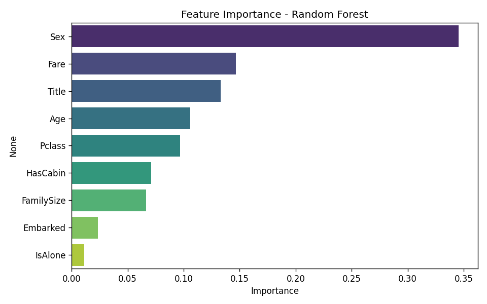
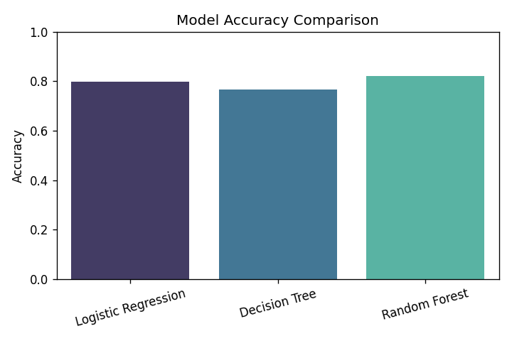
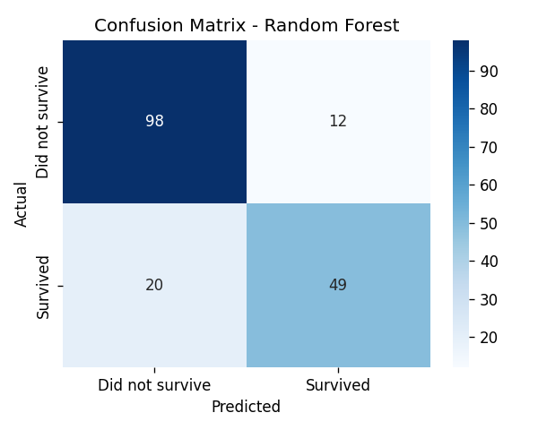

# Titanic Survival Prediction

A machine learning project that predicts whether a passenger survived the Titanic disaster, based on features like age, sex, ticket class, and fare. Built as a hands-on project to practice the full ML workflow: data cleaning, feature engineering, model comparison, and evaluation.

## Problem

Given passenger data (age, sex, class, fare, family aboard, etc.), predict whether that passenger survived. This is a classic binary classification problem, using the well-known Titanic dataset (891 passengers).

## Approach

1. **Data Cleaning**
   - Filled missing `Age` values with the median age
   - Filled missing `Embarked` values with the most common port
   - Instead of dropping the mostly-empty `Cabin` column, converted it into a binary `HasCabin` feature (having a cabin likely correlates with ticket class/wealth)

2. **Feature Engineering**
   - `FamilySize` = siblings/spouses + parents/children + self
   - `IsAlone` = whether the passenger was traveling without family
   - `Title` = extracted from passenger name (Mr, Mrs, Miss, Master, etc.) — this single feature captures a mix of age, gender, and social status information

3. **Model Training & Comparison**
   Trained and compared three models to see which handled this data best:

   | Model | Accuracy |
   |---|---|
   | Logistic Regression | 79.9% |
   | Decision Tree | 76.5% |
   | **Random Forest** | **82.1%** |

   Random Forest performed best, likely because it captures non-linear relationships (e.g., "female AND first class" survives at a very different rate than either factor alone).

4. **Evaluation**
   Beyond accuracy, looked at precision/recall since the classes are imbalanced (more people died than survived). Confusion matrix and classification report included in the results.

## Key Insight

Feature importance from the Random Forest model shows `Sex` was by far the strongest predictor of survival, followed by `Fare`, `Title`, and `Age` — consistent with the historical "women and children first" evacuation policy and the fact that wealthier passengers (higher fare) had better access to lifeboats.



## Results




## What I'd Improve With More Time

- Try hyperparameter tuning (GridSearchCV) to squeeze more performance out of Random Forest
- Test gradient boosting models (XGBoost/LightGBM)
- Engineer more features from the `Ticket` field (shared ticket numbers might indicate traveling groups not captured by `Parch`/`SibSp`)
- Cross-validation instead of a single train/test split, for a more robust accuracy estimate

## How to Run

```bash
pip install pandas numpy scikit-learn matplotlib seaborn
python titanic_model.py
```

## Tech Stack

Python, Pandas, NumPy, Scikit-learn, Matplotlib, Seaborn

## Dataset

[Titanic dataset](https://www.kaggle.com/c/titanic/data) — 891 passengers, 12 original features.
